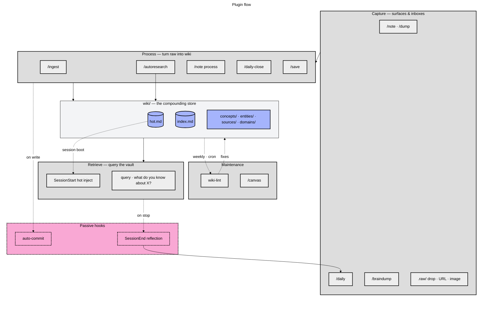

# claude-obsidian

Obsidian wiki plugin for Claude Code — personal knowledge vault with LLM-assisted ingestion, research, and retrieval.



**Legend**: phase orchestrators (medium gray subgraphs) wrap specialist skills (light gray). The wiki itself (indigo) is the compounding store every phase reads from or writes to. Passive hooks (dashed pink) run silently on session events.

## Install

**Prerequisites:**
- Obsidian 1.12.7+ (shipped with the native CLI in 2026)
- The Obsidian binary on your `PATH` (or Flatpak alias; see `skills/wiki/references/cli-setup.md`)

**Plugin installation:**
```bash
claude plugin marketplace add misiekhardcore/claude-obsidian
claude plugin install claude-obsidian@claude-obsidian
```

**Vault registration:**
1. Set `vault_path` when Claude Code prompts for user configuration
2. Register your vault with the CLI (one-time, per vault):
   ```bash
   obsidian register vault=/absolute/path/to/vault
   ```
3. Verify registration: `obsidian list vaults`

For detailed CLI setup (troubleshooting, Flatpak, sanity checks), see `skills/wiki/references/cli-setup.md`.

## Skills

- `wiki` — bootstrap / health-check the vault
- `ingest` — parallel batch ingestion of sources
- `query` — answer questions from vault content
- `lint` — find orphan pages, dead links, stale claims
- `save` — save the current conversation or insight into the vault
- `notes` — quick inbox capture (`/note`, `/dump`); list and process flows for triage
- `daily` — append-only chronological log (`/daily`); timestamped bullets in `daily/YYYY-MM-DD.md`
- `daily-close` — end-of-day synthesis (`/daily-close`, "close today", "wrap up today"); appends a polished `## Summary` to today's daily file, idempotent on re-run
- `braindump` — split long-form text into atomic notes (`/braindump`, "brain dump this", "split this into notes"); each chunk filed via the full capture pipeline
- `autoresearch` — autonomous iterative research loop
- `canvas` — create / update Obsidian canvas files
- `defuddle` — strip clutter from web pages before ingestion
- `obsidian-markdown` — correct Obsidian-flavored Markdown (wikilinks, embeds, callouts)
- `obsidian-bases` — create / edit `.base` files

## Vault structure

```
<vault_path>/
  wiki/          agent-generated knowledge (hot.md, index.md, concepts/, entities/, sources/)
  notes/         inbox: verbatim quick-capture notes (owned by `notes` skill)
  daily/         chronological daily log — one file per day (owned by `daily` skill)
  .raw/          immutable source documents + .manifest.json
  _templates/    Obsidian Templater templates
  _attachments/  images + PDFs referenced by wiki pages
  .obsidian/     (user-owned) Obsidian app config
```

## Hooks

The plugin wires several passive automations into every session via `hooks/hooks.json`. All of them resolve the vault path through `scripts/resolve-vault.sh` and silently skip if no vault is configured.

- **SessionStart — hot cache restore.** If `wiki/hot.md` exists and `bootstrap_read_hot` is `"always"`, its contents are injected into the session so recent context is available immediately. The default is `"on-demand"` — injection is skipped and wiki skills read hot.md when they activate, saving ~2–3k tokens/turn for non-wiki sessions. See [Auto-Read Gating](_shared/hot-cache-protocol.md).
- **PostCompact — hot cache restore.** Re-injects `wiki/hot.md` after context compaction when `bootstrap_read_hot` is `"always"` (hook-injected context does not survive compaction).
- **PostToolUse (Edit | Write) — auto-commit.** Changes under `wiki/` and `.raw/` are auto-committed to the vault's git history with a timestamp, keeping review/blame workflow intact.
- **PostToolUse (Edit | Write) — scratch log.** Touched file paths are appended to `$VAULT/.session-scratch.log` for the SessionEnd reflection to consume.
- **Stop — hot cache nudge.** If wiki pages changed this session, Claude is prompted to refresh `wiki/hot.md` before stopping.
- **SessionEnd — end-of-session reflection.** A short reflection focused on **patterns, decisions, and learnings** (not raw facts) is generated via `claude -p --model claude-haiku-4-5` and appended to `$VAULT/daily/YYYY-MM-DD.md`. Designed to complement, not duplicate, auto-memory at `~/.claude/projects/*/memory/`. Fully non-blocking with a 60s timeout — if the CLI is unavailable or the call errors, the session still ends cleanly.

Non-trivial hook logic lives in `hooks/*.sh`; `hooks.json` itself contains only thin invocations. The SessionEnd reflection creates `$VAULT/daily/` on demand if it doesn't exist.

## Scheduled Maintenance

The plugin does **not** auto-schedule `wiki-lint`. Claude Code has no native cron/scheduled hook, and coupling a maintenance task to whenever a session happens to start is unreliable. Lint is therefore **opt-in via your OS scheduler** (cron, `systemd --user` timers, launchd, etc.).

A ready-to-schedule runner ships at `bin/wiki-lint-cron.sh`. It:

1. Resolves the vault path via `scripts/resolve-vault.sh` (exits non-zero if no vault is configured, so cron surfaces the error in mail/logs).
2. Invokes the `lint` skill through `claude -p` with pre-authorization to auto-fix every category the skill classifies as 'safe to auto-fix' and commit the changes.
3. On success, stamps `$VAULT/.wiki-lint.lastrun` with the current Unix timestamp.

The runner derives `CLAUDE_PLUGIN_ROOT` from its own path when the env var isn't set, so it works from cron without a Claude Code session.

### Example crontab (weekly, Sunday 03:00)

```cron
0 3 * * 0 /absolute/path/to/claude-obsidian/bin/wiki-lint-cron.sh
```

Weekly is a conservative default that matches the `lint` skill's own "after every 10–15 ingests, or weekly" guidance. Pick whatever cadence suits your vault — the runner is stateless apart from the `.wiki-lint.lastrun` marker.

### systemd user timer (alternative)

If you prefer systemd timers, create `~/.config/systemd/user/wiki-lint.service` and `~/.config/systemd/user/wiki-lint.timer`, then `systemctl --user enable --now wiki-lint.timer`. The service's `ExecStart=` should point at `/absolute/path/to/claude-obsidian/bin/wiki-lint-cron.sh`.

## More

- Plugin homepage: <https://github.com/misiekhardcore/claude-obsidian>
- Agent-facing docs (skills, vault structure, ingest rules): [`CLAUDE.md`](CLAUDE.md)
