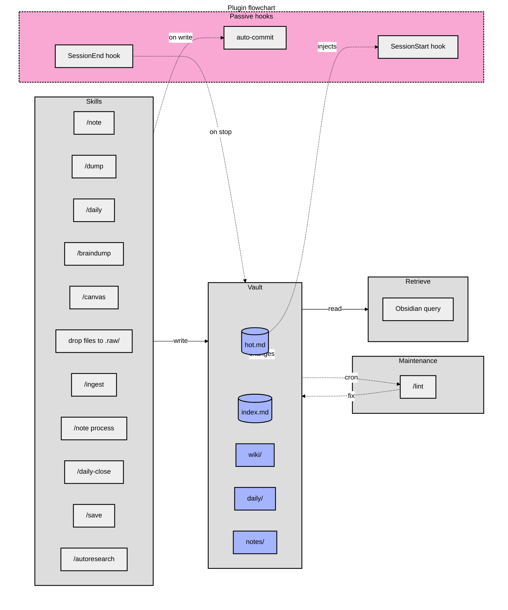

# claude-obsidian

Obsidian wiki plugin for Claude Code — personal knowledge vault with LLM-assisted ingestion, research, and retrieval.



**Legend**: phase orchestrators (medium gray subgraphs) wrap specialist skills (light gray). The wiki itself (indigo) is the compounding store every phase reads from or writes to. Passive hooks (dashed pink) run silently on session events.

## Install

**Prerequisites:** Obsidian 1.12.7+ and the Obsidian CLI binary on your `PATH`.

**Plugin installation:**
```bash
claude plugin marketplace add misiekhardcore/claude-obsidian
claude plugin install claude-obsidian@claude-obsidian
```

**Vault registration:**
1. Set `vault_path` when Claude Code prompts for user configuration
2. Register your vault: `obsidian register vault=/absolute/path/to/vault`
3. Verify: `obsidian list vaults`

See `skills/wiki/references/cli-setup.md` for troubleshooting and Flatpak setup.

## Skills

- `wiki` — bootstrap / health-check the vault
- `ingest` — parallel batch ingestion of sources
- `query` — answer questions from vault content
- `lint` — find orphan pages, dead links, stale claims
- `save` — save the current conversation or insight into the vault
- `notes` — quick inbox capture (`/note`, `/dump`); list and process flows for triage
- `daily` — append-only chronological log (`/daily`); timestamped bullets in `daily/YYYY-MM-DD.md`
- `daily-close` — end-of-day synthesis (`/daily-close`, "close today", "wrap up today"); appends a polished `## Summary` to today's daily file, idempotent on re-run
- `braindump` — split long-form text into atomic notes (`/braindump`, "brain dump this", "split this into notes"); each chunk filed via the full capture pipeline
- `autoresearch` — autonomous iterative research loop
- `canvas` — create / update Obsidian canvas files
- `defuddle` — strip clutter from web pages before ingestion
- `obsidian-markdown` — correct Obsidian-flavored Markdown (wikilinks, embeds, callouts)
- `obsidian-bases` — create / edit `.base` files

## Vault structure

```text
<vault_path>/
  wiki/          agent-generated knowledge (hot.md, index.md, concepts/, entities/, sources/)
  notes/         inbox: verbatim quick-capture notes (owned by `notes` skill)
  daily/         chronological daily log — one file per day (owned by `daily` skill)
  .raw/          immutable source documents + .manifest.json
  _templates/    Obsidian Templater templates
  _attachments/  images + PDFs referenced by wiki pages
  .obsidian/     (user-owned) Obsidian app config
```

## Hooks

The plugin auto-runs passive automations via `hooks/hooks.json`:

- **SessionStart — hot cache restore.** Injects `wiki/hot.md` if `bootstrap_read_hot` is `"always"` (default: `"on-demand"`, read by skills on activation to save tokens).
- **PostCompact — hot cache restore.** Re-injects after context compaction.
- **PostToolUse (Edit | Write) — auto-commit.** Changes under `wiki/` and `.raw/` are committed to vault git.
- **PostToolUse (Edit | Write) — scratch log.** Touched files logged for SessionEnd reflection.
- **Stop — hot cache nudge.** If wiki changed, prompt to refresh `wiki/hot.md`.
- **SessionEnd — end-of-session reflection.** Patterns/decisions/learnings synthesized and appended to daily file (non-blocking, 60s timeout).

Hook logic in `hooks/*.sh`; `hooks.json` has thin invocations only.

## Scheduled Maintenance

Lint is **opt-in via OS scheduler** (cron, systemd timers, launchd). Use `bin/wiki-lint-cron.sh` to run the lint skill with auto-fix and commit.

**Example crontab (weekly, Sunday 03:00):**
```cron
0 3 * * 0 /absolute/path/to/claude-obsidian/bin/wiki-lint-cron.sh
```

**systemd user timer:**
Create `~/.config/systemd/user/wiki-lint.service` and `~/.config/systemd/user/wiki-lint.timer`, then `systemctl --user enable --now wiki-lint.timer`.

## Contributing

**Prerequisites:** Node.js ≥ 20 and npm.

```bash
npm install                # Install husky, lint-staged, pre-commit hook
npm run format            # Minify all .md files
```

Pre-commit hook applies formatting via `lint-staged` to staged files.

## More

- Plugin homepage: <https://github.com/misiekhardcore/claude-obsidian>
- Agent-facing docs (skills, vault structure, ingest rules): [`CLAUDE.md`](CLAUDE.md)
