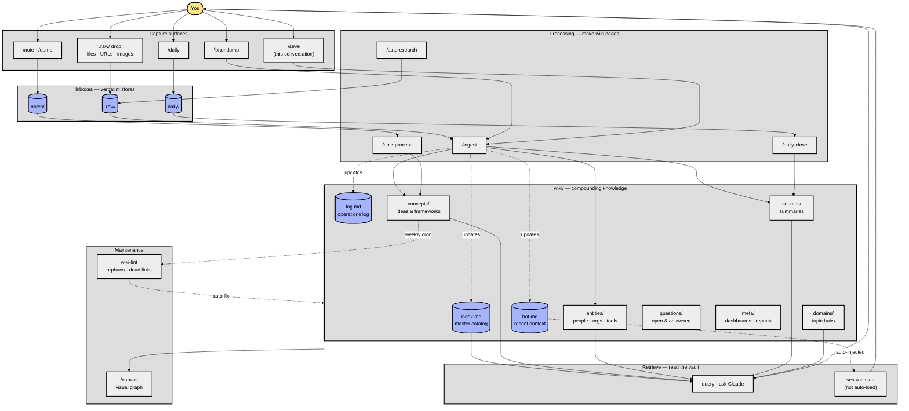

# Getting Started with claude-obsidian

Welcome. This vault is your compounding knowledge base — a persistent second brain built with Claude and Obsidian.

Every source you add gets processed into 8–15 cross-referenced wiki pages. Every question you ask pulls from everything that's been ingested. Knowledge compounds like interest.

---

## How it works — data flow



**Reading the diagram**: you (yellow) interact through capture surfaces (light gray) that land in verbatim inboxes (indigo). Processing skills turn inboxes into structured wiki pages. The wiki feeds retrieval — both explicit queries and the auto-loaded hot cache at session start. Maintenance runs on a cadence (manual or cron) and writes back into the wiki.

---

## Three-Step Quick Start

### 1. Drop a source

Put any document into the `.raw/` folder:
- PDFs, markdown files, transcripts, articles
- Or paste a URL and ask Claude to fetch it

### 2. Ingest it

Tell Claude in any Claude Code session:

```
ingest [filename]
```

Claude reads the source, creates 8–15 wiki pages under `wiki/`, cross-references everything, and updates `wiki/index.md`, `wiki/log.md`, and `wiki/hot.md`.

### 3. Ask questions

```
what do you know about [topic]?
```

Claude reads the hot cache, scans the index, drills into relevant pages, and gives you a synthesized answer — citing specific wiki pages, not training data.

---

## How the Hot Cache Works

`wiki/hot.md` is a ~500-word summary of recent vault context. It loads automatically at the start of every session (via the SessionStart hook).

You don't need to recap. Claude starts every session knowing what you've been working on.

Update it manually at any time: `update hot cache`

---

## Your First Ingest — Walkthrough

1. Create a file in `.raw/` — copy a transcript, paste an article, or save a PDF
2. Open Claude Code in this vault folder
3. Type: `ingest [your-filename]`
4. Watch the wiki grow — Claude will report which pages it created
5. Open `wiki/index.md` — you'll see the new pages listed
6. Open Graph View in Obsidian — a new cluster of connected nodes appears

After 3–5 ingests, the graph starts to look like a real knowledge network. Cross-references emerge automatically.

---

## Key Commands

| You say | Claude does |
|---------|-------------|
| `ingest [file]` | Creates 8–15 wiki pages from a source |
| `what do you know about X?` | Queries the wiki, cites pages |
| `/save` | Files this conversation as a wiki note |
| `/autoresearch [topic]` | Searches the web, ingests results autonomously |
| `lint the wiki` | Health check — finds orphans, gaps, stale links |
| `update hot cache` | Refreshes the session context summary |

---

## Next Steps

- Open **[[index]]** for the master catalog of every page in your vault.
- Read **[[hot]]** to see what context Claude is currently carrying into sessions.
- Drop your first source into `.raw/` and run an ingest.

---

*Built on the LLM Wiki pattern by Andrej Karpathy: https://gist.github.com/karpathy/442a6bf555914893e9891c11519de94f*
