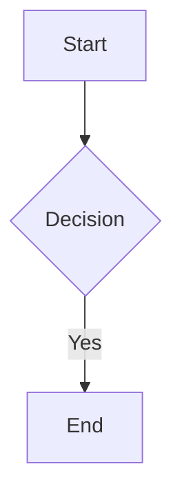

# Obsidian Markdown Syntax Tables

## Wikilinks

|Syntax|What it does|
|-|-|
|`[[Note Name]]`|Basic link|
|`[[Note Name\|Display Text]]`|Aliased link (shows "Display Text")|
|`[[Note Name#Heading]]`|Link to a specific heading|
|`[[Note Name#^block-id]]`|Link to a specific block|

Rules: Case-sensitive on some systems. Match the exact filename. No path needed unless two files share a name (use `[[Folder/Note Name]]` to disambiguate).

## Embeds

|Syntax|What it does|
|-|-|
|`![[Note Name]]`|Embed a full note|
|`![[Note Name#Heading]]`|Embed a section|
|`![[image.png]]`|Embed an image|
|`![[image.png\|300]]`|Embed image with width 300px|
|`![[document.pdf]]`|Embed a PDF (native rendering)|
|`![[audio.mp3]]`|Embed audio|

## Callout Types

|Type|Aliases|Use for|
|-|-|-|
|`note`|:|General notes|
|`abstract`|`summary`, `tldr`|Summaries|
|`info`|:|Information|
|`todo`|:|Action items|
|`tip`|`hint`, `important`|Tips and highlights|
|`success`|`check`, `done`|Positive outcomes|
|`question`|`help`, `faq`|Open questions|
|`warning`|`caution`, `attention`|Warnings|
|`failure`|`fail`, `missing`|Errors or failures|
|`danger`|`error`|Critical issues|
|`bug`|:|Known bugs|
|`example`|:|Examples|
|`quote`|`cite`|Quotations|
|`contradiction`|:|Conflicting information (wiki convention)|

## Text Formatting

|Syntax|Result|
|-|-|
|`**bold**`|Bold|
|`*italic*`|Italic|
|`~~strikethrough~~`|Strikethrough|
|`==highlight==`|Highlighted text (yellow in Obsidian)|
|`` `inline code` ``|Inline code|

## Tags

Inline: `#tag-name` (single) or `#parent/child-tag` (nested).

In frontmatter:
```yaml
tags:
  - research
  - ai/obsidian
```

Do not use `#` in frontmatter tag lists.

## Properties (Frontmatter) Rules

Flat YAML only:
- Dates as `YYYY-MM-DD` (not ISO datetime)
- Lists as `- item` (not inline `[a, b, c]`)
- Wikilinks must be quoted: `"[[Page]]"`
- `tags` field uses list format; Obsidian searches it

Example:
```yaml
---
type: concept
title: "Note Title"
created: 2026-04-08
updated: 2026-04-08
tags:
  - tag-one
  - tag-two
status: developing
related:
  - "[[Other Note]]"
sources:
  - "[[source-page]]"
---
```

## Math & Code

**Inline math:** `$E = mc^2$` (MathJax/KaTeX)

**Block math:**
```
$$
\int_0^\infty e^{-x} dx = 1
$$
```

**Code blocks:**
````
```python
def hello():
    return "world"
```
````

**Tables:**
```markdown
| Column A | Column B |
| -------- | -------- |
| Value    | Value    |
```

**Mermaid diagrams:**
````

````

Supported: `graph`, `sequenceDiagram`, `gantt`, `classDiagram`, `pie`, `flowchart`.

## Footnotes

```markdown
This sentence has a footnote.[^1]

[^1]: The footnote text goes here.
```

## Do NOT Do

- Don't use `[text](path.md)` for internal links; use `[[Note Name]]`
- Don't use HTML inside callouts
- Don't use `##` inside callout body
- Don't write `tags: [a,b,c]` inline; use list format
- Don't use ISO datetime in frontmatter; use `YYYY-MM-DD`
